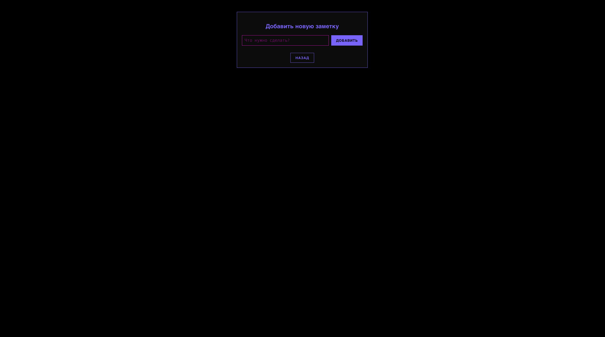

# Todo-App

This is a simple Todo application with a Node.js/Express backend and a vanilla JavaScript, HTML, and CSS frontend.

## Features

- Add, edit, and delete todo items
- Pagination for managing large lists of todos
- Cyberpunk-themed UI
- Dynamic weather and GIF panels
- Date and time display

## Setup

To get this project up and running, follow these steps:

### Prerequisites

- Node.js (LTS version recommended)
- npm (Node Package Manager)

### Backend Setup

1. **Navigate to the backend directory:**
   ```bash
   cd ../todo-server # Assuming your backend is in a separate `todo-server` directory outside this project
   ```

2. **Install dependencies:**
   ```bash
   npm install
   ```

3. **Start the backend server:**
   ```bash
   npm start
   ```
   The backend server should now be running, typically on `http://localhost:3000`.

### Frontend Setup

1. **Navigate to the frontend directory:**
   ```bash
   cd todo-app # Or wherever your frontend project is located, e.g., if you are already in the root of the frontend project, you don't need to cd.
   ```

2. **Create a `.env` file:**
   Create a file named `.env` in the root of the `todo-app` directory. This file will store your environment variables.

3. **Configure Environment Variables:**
   Add the following lines to your `.env` file, replacing the placeholder URLs with your actual backend server URL and Weather API Key:
   ```
   VITE_API_URL=http://localhost:3000/api/todos
   VITE_WEATHER_API_KEY=YOUR_OPENWEATHERMAP_API_KEY
   VITE_WEATHER_CITY=YOUR_CITY_NAME # e.g., London, Moscow, New York
   ```
   *   `VITE_API_URL` is used in `src/api/todos.ts` to connect to your backend.
   *   `VITE_WEATHER_API_KEY` and `VITE_WEATHER_CITY` are used in `src/components/WeatherPanel.ts` for fetching weather data.

4. **Install dependencies (if any, though this project uses vanilla JS/HTML/CSS, you might have Vite or similar for development):**
   ```bash
   npm install # If you have a package.json
   ```

5. **Run the frontend application (if using a dev server like Vite):**
   ```bash
   npm run dev
   ```
   If you are just serving static files, you can open `index.html` directly in your browser or use a simple static file server.

## Usage

- Open your web browser and navigate to the address where the frontend is served (e.g., `http://localhost:5173` if using Vite development server).
- You can add new tasks, mark them as complete, edit their titles, and delete them.
- Navigate through pages using the pagination controls.
- Explore the additional panels for weather information, GIFs, and date/time.

## Project Structure

```
. # todo-app root
├── src/
│   ├── api/             # API client functions
│   ├── components/      # Reusable UI components
│   ├── pages/           # Page-level components/views
│   ├── style.css        # Global styles
│   ├── main.ts          # Main entry point for the application
│   ├── router.ts        # Frontend routing logic
│   └── types.ts         # TypeScript type definitions
├── index.html           # Main HTML file
├── package.json         # Frontend dependencies (if any)
├── tsconfig.json        # TypeScript configuration
└── vite.config.ts       # Vite configuration (if applicable)
```
## Screenshots

### 📋 Home page TODO


### ➕ Add a note


### 🌆 Gif selection page

## Contributing


Feel free to fork the repository, open issues, and submit pull requests.

## License

Copyright (c) [Dave Mur 14 jun 2025] 

Permission is hereby granted, free of charge, to any person obtaining a copy
of this software and associated documentation files (the "Software"), to deal
in the Software without restriction, including without limitation the rights
to use, copy, modify, merge, publish, distribute, sublicense, and/or sell
copies of the Software, and to permit persons to whom the Software is
furnished to do so, subject to the following conditions:

The above copyright notice and this permission notice shall be included in all
copies or substantial portions of the Software.

THE SOFTWARE IS PROVIDED "AS IS", WITHOUT WARRANTY OF ANY KIND, EXPRESS OR
IMPLIED, INCLUDING BUT NOT LIMITED TO THE WARRANTIES OF MERCHANTABILITY,
FITNESS FOR A PARTICULAR PURPOSE AND NONINFRINGEMENT. IN NO EVENT SHALL THE
AUTHORS OR COPYRIGHT HOLDERS BE LIABLE FOR ANY CLAIM, DAMAGES OR OTHER
LIABILITY, WHETHER IN AN ACTION OF CONTRACT, TORT OR OTHERWISE, ARISING FROM,
OUT OF OR IN CONNECTION WITH THE SOFTWARE OR THE USE OR OTHER DEALINGS IN THE
SOFTWARE.
